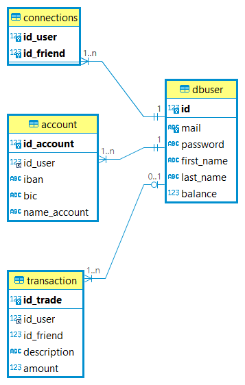
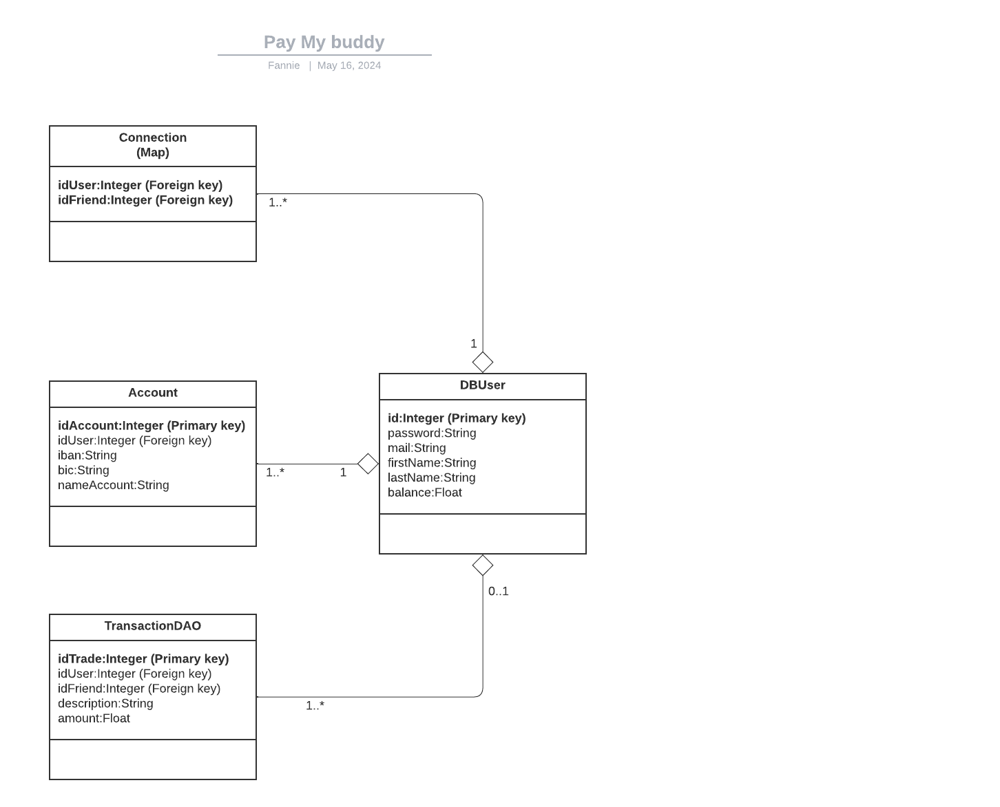

# Readme : Pay-my-Buddy

Schéma de conception de base de donnée

* dBUser : gère  les informations de l’utilisateur
* connection: permet de faire le lien entre l’utilisateur et l’ami
* account: détails des comptes bancaires des amis
* transaction: stocke les données de chaque transaction pour faire leur historique

